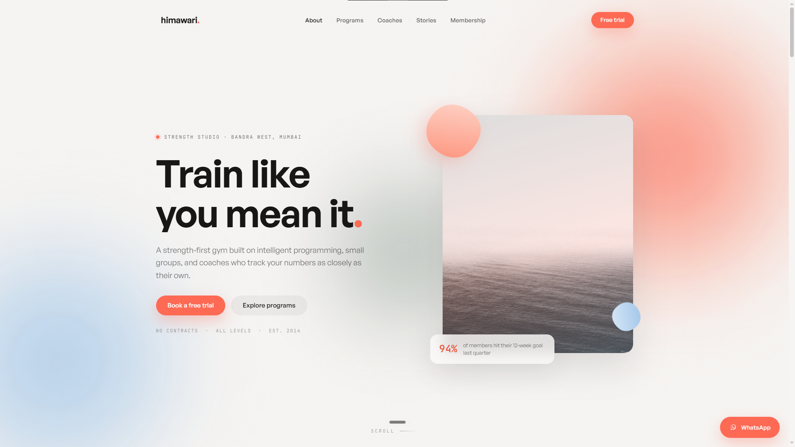
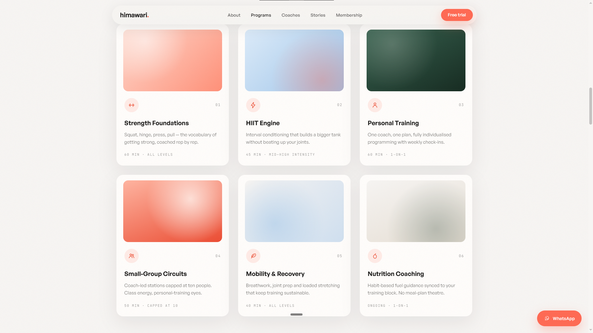
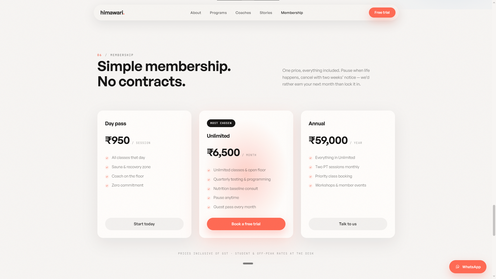
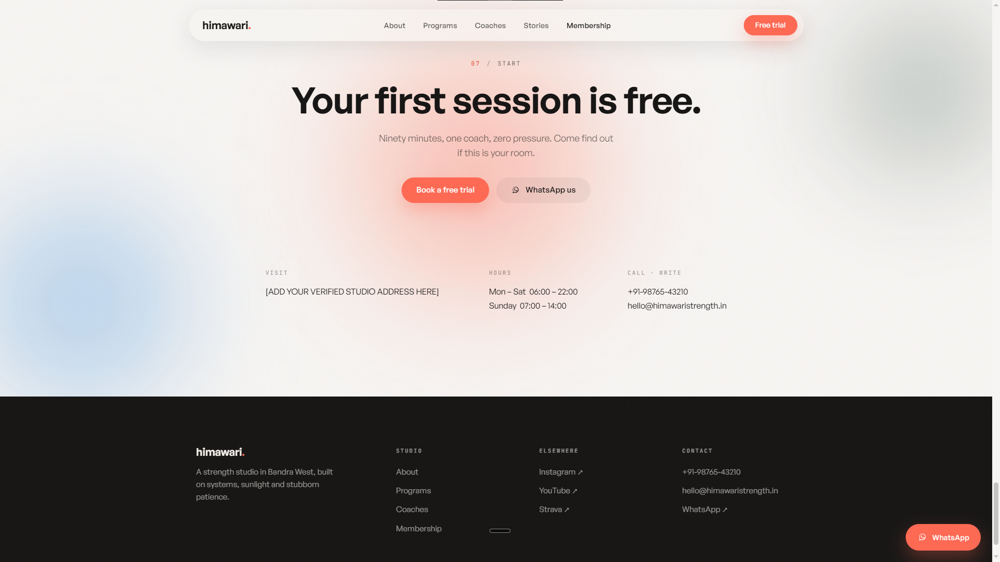

# Himawari — Strength Studio, Bandra West

A landing page concept for a strength-first training studio in Bandra West, Mumbai — the kind of gym that tracks your numbers instead of just counting your visits.

🔗 **Live:** https://project-himawari.akshaycodecrafter.workers.dev/

## Preview

*The hero — headline, strength-studio tagline, and a live "94% of members hit their 12-week goal" stat.*

*The six-program grid: Strength Foundations, HIIT Engine, Personal Training, Small-Group Circuits, Mobility & Recovery, Nutrition Coaching.*

*Three simple pricing tiers — Day pass, Unlimited, Annual — with the middle plan marked "Most chosen."*

*The closing CTA, studio hours, and contact details, plus the footer.*

## About

Most gym websites in this space look identical — a hero shot of someone mid-deadlift, a list of "world-class equipment," and a contact form that goes nowhere. I wanted to build one that actually sounded like a real Bandra studio: small-group focused, coach-led, numbers over vibes. Himawari is that attempt — a strength studio site built around programming and progress tracking rather than generic gym marketing copy.

## What's on the page

- **Hero** — headline and first-session-free CTA
- **Programs** — six offerings: Strength Foundations, HIIT Engine, Personal Training, Small-Group Circuits, Mobility & Recovery, Nutrition Coaching
- **Trainers** — four coach profiles (Arjun Mehta, Sara Fernandes, Kabir Rao, Ananya Sharma)
- **Results** — a "proof, not promises" section with member outcomes
- **Member stories** — testimonials from real-sounding members
- **Membership** — three tiers: Day pass, Unlimited, Annual
- **Contact** — visit info, hours, click-to-call and click-to-WhatsApp, plus a floating WhatsApp button

## Built with

- HTML5, CSS3, JavaScript (vanilla)
- IntersectionObserver-driven scroll reveals and scrollspy nav
- Sticky nav with scroll-based state, mobile burger menu
- Click-to-call and click-to-WhatsApp links throughout, no contact form

## Why I built it this way

Every gym site I looked at while researching this leaned on generic stock-photo energy and copy like "transform your body." I wanted Himawari to read like a studio that actually knows its members' names — hence trainer profiles with real specialities instead of a generic "our team" grid, and a results section framed as "proof, not promises." The contact flow is deliberately friction-free too — no form to fill out, just tap and you're either calling, emailing, or already typing on WhatsApp.

## Running it locally

It's a self-contained static site split into:himawari/
├── index.html
├── css/style.css
└── js/script.js   
Just clone and open `index.html` in a browser — no build step, no dependencies to install.

## Status

This is a demo/concept build — the studio, trainers, member stories, and contact details are illustrative, not a live business.
